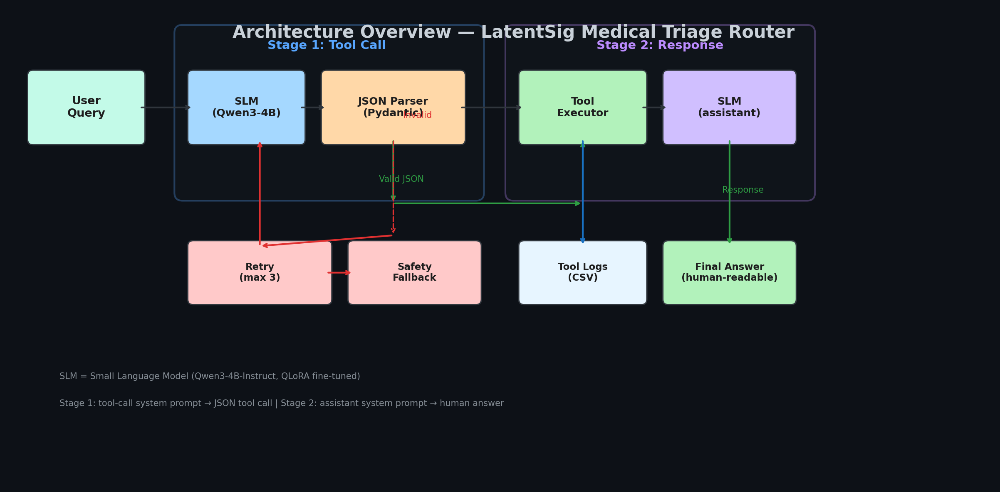
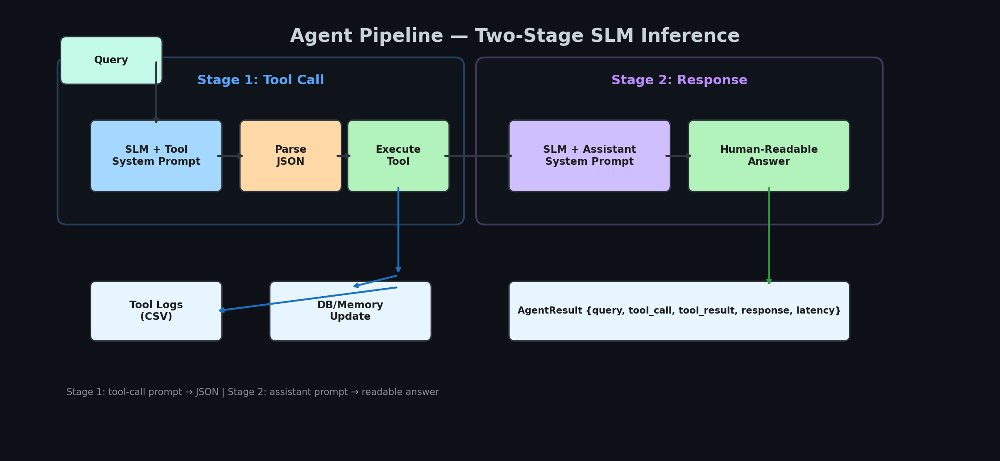
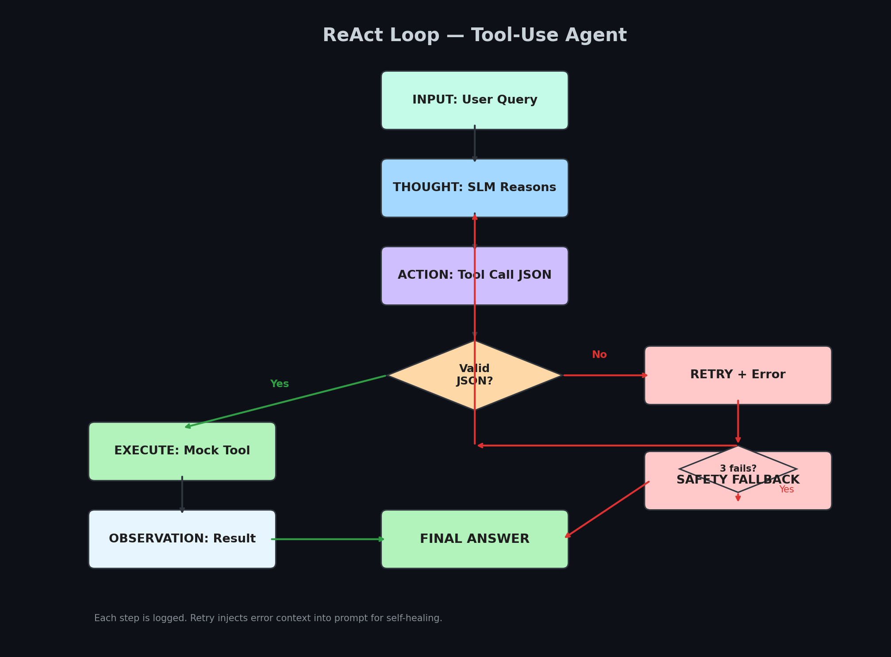
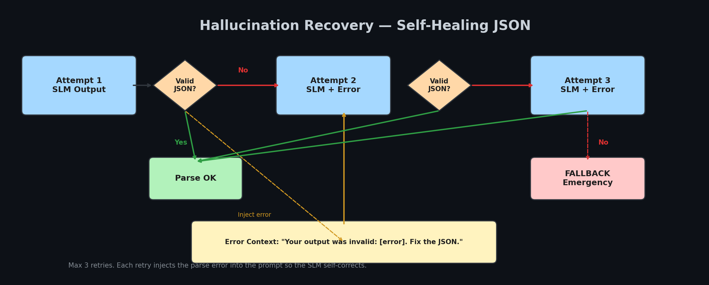
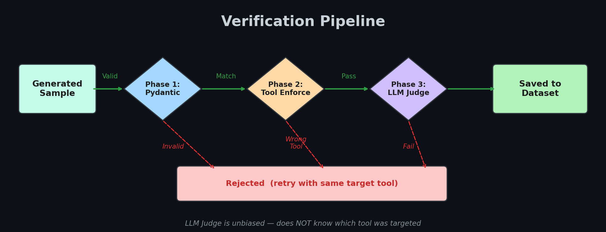
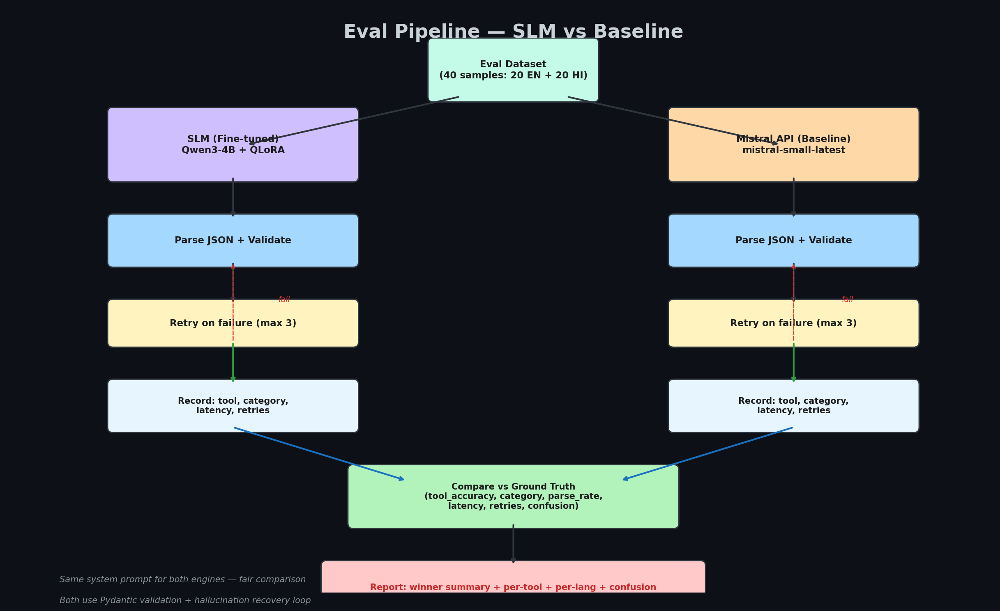

# LatentSig Medical Triage Router

> A local-first agentic workflow where a fine-tuned Small Language Model (SLM) acts as a reliable structured router for clinical medical triage.

**Author:** LatentSig  
**Model:** Qwen3-4B-Instruct (QLoRA fine-tuned)  
**Dataset:** [fhai50032/latentsig-med-triage-router](https://huggingface.co/datasets/fhai50032/latentsig-med-triage-router)  
**GitHub:** [IsNoobgrammer/latentsig-slm-router-med](https://github.com/IsNoobgrammer/latentsig-slm-router-med)  
**Training:** [W&B Report](https://wandb.ai/ablations-tinycompany-ai/latentsig-med-triage-router/reports/LatentSig-SLM-Router--VmlldzoxNzA2MzQ3OA)  
**GGUF:** [fhai50032/latentsig-med-router-qwen3-4b-gguf](https://huggingface.co/fhai50032/latentsig-med-router-qwen3-4b-gguf)

---

## Architecture Overview



### Agent Pipeline



The SLM runs twice per query:
1. **Tool Call** — reads tool definitions, selects tool, outputs JSON
2. **Response** — reads tool result, synthesizes human-readable summary

---

## Project Structure

```
latentsig-slm-router-med/
│
├── src/                              ← Agentic loop + inference
│   ├── agent.py                      ← Phase 2: ReAct loop (placeholder engine)
│   ├── agent_colab.py                ← Phase 2: Two-stage SLM loop (Colab)
│   ├── config.py                     ← Model paths, hyperparams
│   ├── inference.py                  ← SLMEngine (Unsloth) + PlaceholderEngine
│   ├── parser.py                     ← JSON extraction + Pydantic validation
│   ├── prompts.py                    ← System prompts (tool-call + assistant)
│   ├── tools.py                      ← 7 deterministic mock tools + CSV logging
│   └── test_agent.py                 ← Smoke test (10 queries)
│
├── synth-ds-framework/               ← Dataset generation pipeline
│   ├── orchestrator_parallel.py      ← Parallel datagen (32 workers, 8 keys)
│   ├── orchestrator.py               ← Serial datagen (fallback)
│   ├── verifier.py                   ← 3-layer: Pydantic + tool enforce + LLM judge
│   ├── tool_schemas.py               ← 7 tool definitions (flat params)
│   ├── prompts.py                    ← Query generation prompts
│   ├── models.py                     ← Pydantic models (TriageCall, DatasetRecord)
│   ├── monitor.py                    ← Flask dashboard (localhost:5000)
│   ├── gen_eval.py                   ← Eval dataset generator
│   ├── gen_visuals.py                ← Seaborn/matplotlib visualizations
│   ├── gen_flowcharts.py             ← Flowchart image generator
│   └── tool-schema/                  ← 91+ extended tool schemas (future)
│
├── tool_logs/                        ← Per-tool CSV logs (generated at runtime)
│   ├── triage_assessment.csv
│   ├── vital_signs_analysis.csv
│   ├── medication_check.csv
│   ├── specialist_referral.csv
│   ├── emergency_dispatch.csv
│   ├── mental_health_triage.csv
│   └── lab_order_suggestion.csv
│
└── README.md                         ← This file
```

---

## Tool Definitions

The SLM must select from 7 tools. Each tool has flat parameters (no nesting) for easier SLM learning.

| Tool | Description | Key Parameters |
|------|-------------|----------------|
| `triage_assessment` | Initial symptom triage + urgency | chief_complaint, symptoms, severity, urgency_level |
| `vital_signs_analysis` | Analyze vitals for clinical decisions | bp_systolic, bp_diastolic, heart_rate, spo2_percent |
| `medication_check` | Drug interaction / dosage / overdose | medications, check_type, patient_condition |
| `specialist_referral` | Route to appropriate specialty | specialty, reason, urgency |
| `emergency_dispatch` | Life-threatening conditions ONLY | condition, symptoms, transport_type |
| `mental_health_triage` | Crisis assessment + routing | concern_type, risk_level, immediate_intervention |
| `lab_order_suggestion` | Suggest diagnostic tests | tests, urgency, suspected_condition |

### Output Format

```json
{
  "reasoning": "1-2 sentence clinical reasoning",
  "category": "emergency|urgent|semi_urgent|routine",
  "department": "<target department>",
  "tool": "<tool_name>",
  "args": { /* tool-specific parameters */ }
}
```

---

## Dataset

**HF:** [fhai50032/latentsig-med-triage-router](https://huggingface.co/datasets/fhai50032/latentsig-med-triage-router)

| Split | Samples | Languages |
|-------|---------|-----------|
| Train | 2,000 | 1,000 EN + 1,000 Hinglish |
| Eval | 40 | 20 EN + 20 Hinglish |

### Generation Pipeline

```
┌─────────────────┐    ┌──────────────────┐    ┌─────────────────┐
│  Tool Schema    │───▶│  Query Generator  │───▶│  Response Gen   │
│  (7 tools)      │    │  (3 Mistral models)│   │  (with hint)    │
└─────────────────┘    └──────────────────┘    └─────────────────┘
                                                        │
                                                        ▼
┌─────────────────┐    ┌──────────────────┐    ┌─────────────────┐
│  Dataset JSONL  │◀───│  3-Layer Verify   │◀───│  Target Tool    │
│  (2,000 rows)   │    │  (Pydantic+Fuzzy  │   │  Enforcement    │
│                 │    │   +LLM Judge)     │   │                 │
└─────────────────┘    └──────────────────┘    └─────────────────┘
```

**Key design:**
- **Tool-balanced:** `pick_target_tool()` uses weighted random favoring least-used tools
- **Target hint:** Response prompt includes `[Use the X tool]` for clean training data
- **3-layer verification:** Pydantic structural → tool enforcement → LLM judge (unbiased)
- **Hash dedup:** `sha256(user_query + verdict)` — no duplicate queries
- **Parallel:** 32 workers, 8 Mistral API keys, ~0.7/s throughput

### Generation Models

| Model | Purpose | Share |
|-------|---------|-------|
| mistral-large-latest | Query + response generation | 23% |
| mistral-medium-latest | Query + response generation | 50% |
| magistral-medium-latest | Query + response generation | 27% |
| mistral-small-latest | LLM judge (unbiased) | 100% |

---

## Agentic Loop (Phase 2)

### ReAct Loop Flow



### Hallucination Recovery



### Two-Stage Inference (agent_colab.py)

```python
# Stage 1: Tool Call
raw, latency = engine.generate(TOOL_CALL_SYSTEM_PROMPT, query)
tool_call = parse_tool_call(raw)  # JSON extraction + validation
tool_result = execute_tool(tool_call["tool"], tool_call["args"])
db.log(tool_call["tool"], tool_call["args"], tool_result)

# Stage 2: Response
context = f"Query: {query}\nDecision: {tool_call}\nResult: {tool_result}"
response, latency = engine.generate(ASSISTANT_SYSTEM_PROMPT, context)
```

### Mock Tools (Deterministic)

Each tool returns fixed data for the same input. All calls logged to CSV.

```python
# Example: emergency_dispatch
def emergency_dispatch(args):
    return {
        "status": "dispatched",
        "condition": args["condition"],
        "transport": args["transport_type"],
        "eta_minutes": 8,
        "dispatch_id": f"EMD-{hash(str(args)) % 10**8:08d}"
    }
```

**Log output:** `tool_logs/emergency_dispatch.csv`
```
call_id,tool,args,result,timestamp
EMD-59F761B4,emergency_dispatch,{...},{...},2026-05-29T18:57:01
```

---

## Fine-Tuning

**Model:** Qwen3-4B-Instruct | **Method:** QLoRA 4-bit | **Hardware:** Colab T4 (16GB)

### Training Config

```python
SFTConfig(
    dataset_text_field="text",
    per_device_train_batch_size=16,
    gradient_accumulation_steps=1,
    num_train_epochs=2,
    learning_rate=7e-5,
    optim="adamw_8bit",
    fp16=True,
    eval_strategy="steps",
    eval_steps=25,
    save_strategy="steps",
    save_steps=50,
    logging_steps=1,
    report_to="wandb",
)
```

### LoRA Config

```python
FastLanguageModel.get_peft_model(
    model,
    r=16,
    target_modules=["q_proj", "k_proj", "v_proj", "o_proj",
                     "gate_proj", "up_proj", "down_proj"],
    lora_alpha=32,
    lora_dropout=0,
    use_gradient_checkpointing="unsloth",
)
```

### Dataset Format (Qwen3 Chat Template)

```python
def format_to_text(row):
    messages = [
        {"role": "system", "content": SYSTEM_PROMPT},
        {"role": "user", "content": row["user_query"]},
        {"role": "assistant", "content": row["response"]},
    ]
    return {"text": tokenizer.apply_chat_template(messages, tokenize=False)}

ds = ds.map(format_to_text, remove_columns=ds.column_names)
```

---

## Verification Pipeline

Every sample passes 3 layers before inclusion:



**Critical:** The LLM judge does NOT know which tool was targeted. It evaluates tool selection purely on medical merit.

---

## Monitoring

**Dashboard:** `python synth-ds-framework/monitor.py` → http://localhost:5000

- Live progress bars (EN / HI_EN vs target)
- Stats cards: total, passed, failed, rate, ETA
- Category / tool / model breakdowns
- Recent samples table
- Dataset viewer at /viewer (sortable, filterable)

---

## Quick Start

### 1. Generate Dataset (already done)

```bash
cd synth-ds-framework
python orchestrator_parallel.py --en 1000 --hi-en 1000 --workers 32
```

### 2. Fine-Tune (Colab)

```python
# Load model
from unsloth import FastLanguageModel
model, tokenizer = FastLanguageModel.from_pretrained(
    model_name="unsloth/Qwen3-4B-Instruct",
    max_seq_length=1280, load_in_4bit=True,
)

# Load dataset
from datasets import load_dataset
ds = load_dataset("fhai50032/latentsig-med-triage-router", split="train")
eval_ds = load_dataset("fhai50032/latentsig-med-triage-router", split="eval")

# Format + train (see finetune.md for full config)
```

### 3. Run Agent

```python
from src.agent_colab import SLMEngine, TriageAgent, ToolDB

engine = SLMEngine(adapter_path="fhai50032/latentsig-med-router-qwen3-4b")
engine.load()

agent = TriageAgent(engine)

# Verbose: shows full ReAct loop (tool call, execution, response)
result = agent.run("68-year-old male, sudden facial droop, cannot speak", verbose=True)

# Silent: only returns result object
result = agent.run("chest pain, 55yo male", verbose=False)

print(result.response)          # Human-readable answer
print(result.tool_call)         # JSON tool call
print(result.tool_result)       # Deterministic tool output
print(result.total_latency_ms)  # End-to-end latency
```

---

## Eval — SLM vs Baseline

The eval system compares the fine-tuned SLM against a Mistral API baseline using the same system prompt. Both are measured on the held-out eval set (40 samples: 20 EN + 20 Hinglish).



### Quick Test (no model needed)

```bash
python -m src.eval --mode placeholder --limit 5
```

### Mistral Baseline Only

```bash
python -m src.eval --mode mistral --eval-file synth-ds-framework/eval_dataset.jsonl
```

### Full Comparison (Colab — GPU + adapter needed)

```bash
python -m src.eval --mode full \
    --adapter-path fhai50032/latentsig-med-router-qwen3-4b \
    --eval-file synth-ds-framework/eval_dataset.jsonl \
    --output eval_results_full.jsonl
```

### Metrics

| Metric | What it measures |
|--------|-----------------|
| **Tool Accuracy** | Exact match: predicted tool == ground truth tool |
| **Category Accuracy** | Emergency/urgent/semi_urgent/routine match |
| **Parse Success Rate** | % of outputs that are valid JSON with all fields |
| **Fallback Rate** | % that hit safety fallback (all retries exhausted) |
| **Avg / P50 / P95 Latency** | Inference latency per query |
| **Avg Retries** | Hallucination recovery attempts per sample |
| **Per-Tool Breakdown** | Accuracy for each of the 7 tools |
| **Per-Language Breakdown** | EN vs Hinglish accuracy |
| **Confusion Matrix** | Which tools get confused for which |

### Agent Mode (end-to-end)

```bash
python -m src.eval --mode full --use-agent
```

With `--use-agent`, the full two-stage loop runs (tool call → execute → respond), measuring retry count and fallback rate accurately.

---

## Key Design Decisions

| Decision | Choice | Rationale |
|----------|--------|-----------|
| SLM | Qwen3-4B-Instruct | #1 fine-tuning benchmark, strong multilingual, Apache 2.0 |
| Fine-tuning | QLoRA 4-bit | Fits T4 16GB, ~5-6GB VRAM |
| LoRA rank | r=16 | Good capacity/speed balance for 4B |
| System prompt | Tool defs in prompt | Model learns to READ tools, not memorize |
| Identity | LatentSig branded | Only tool-calls when given this specific prompt |
| Tools | 7 flat-param tools | Easier for 1B-3B models to learn |
| Verification | 3-layer (Pydantic+Tool+Judge) | Fast structural + unbiased accuracy |
| Generation | 3 Mistral models rotated | Diversity in training data |
| Dedup | Hash on save only | Failed samples can retry same query |
| Output | Per-tool CSV logs | Verifiable out-of-loop |

---

## License

MIT — LatentSig, 2026
