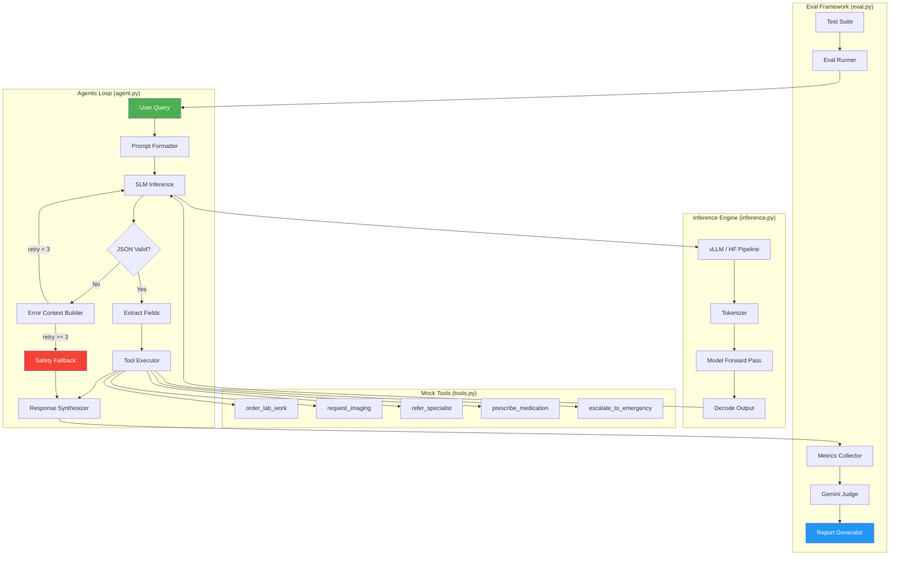
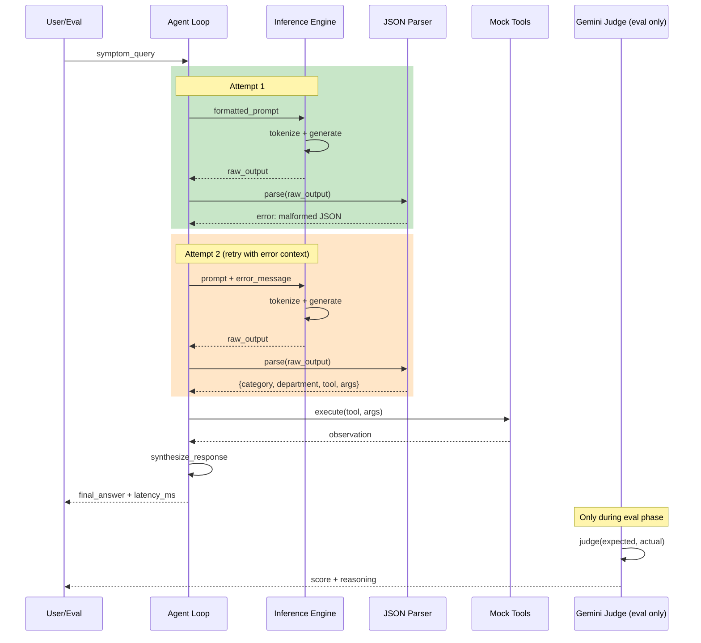
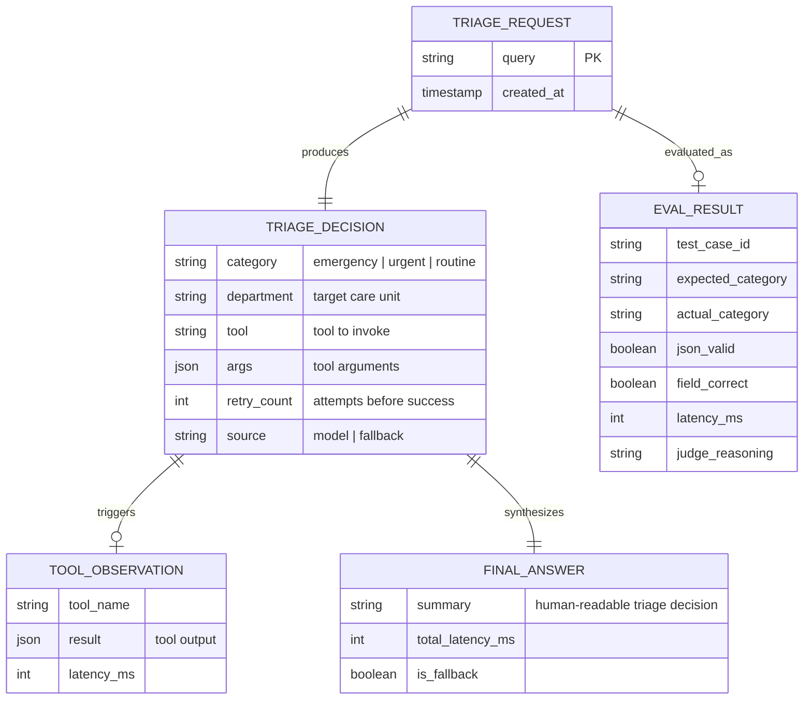
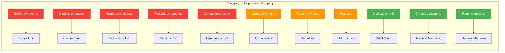
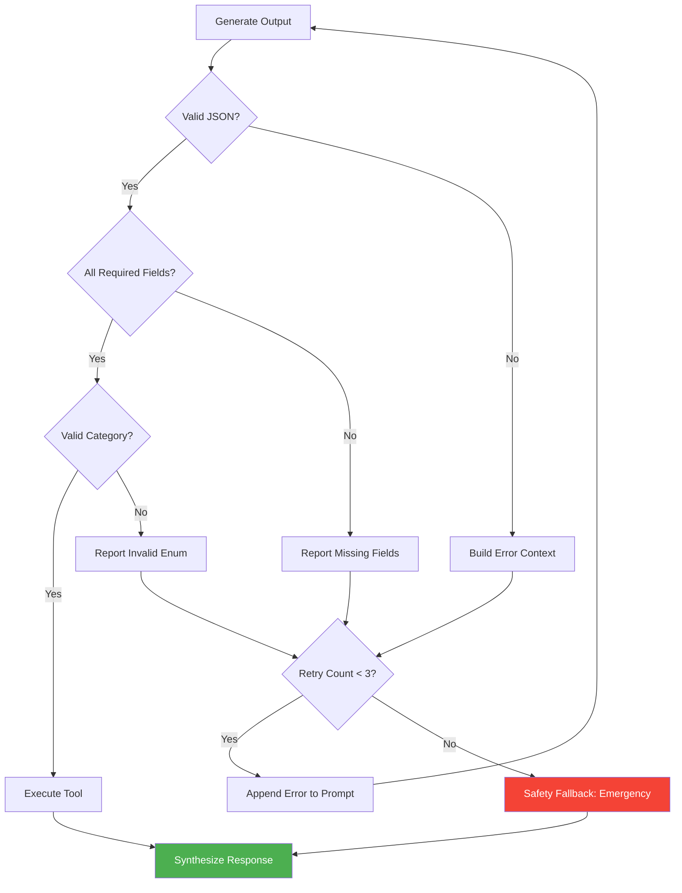

# ARCH.md — LatentSig SLM Router Architecture
> Version: 1.0 | References: PRD.md, DESIGN.md | Last Updated: 2026-05-29

---

## System Diagram



---

## Agentic Loop Sequence Diagram



---

## Triage Data Model



---

## Component Responsibilities

| Component | Owns | Does NOT own |
|-----------|------|-------------|
| Agent Loop (agent.py) | Orchestration, retry logic, fallback policy, response synthesis | Model inference, JSON parsing, tool logic |
| Inference Engine (inference.py) | Model loading, tokenization, generation, KV-cache | Prompt formatting, output validation |
| JSON Parser (parser.py) | JSON extraction, schema validation, field normalization | Model inference, retry decisions |
| Mock Tools (tools.py) | Tool registration, execution, deterministic outputs | Real tool integrations, external APIs |
| Eval Harness (eval.py) | Test cases, metrics computation, report generation | Model inference, tool execution |
| Prompt Templates (prompts.py) | System prompts, retry prompts, fallback messages | Business logic |

---

## Triage Category Taxonomy



---

## Retry & Recovery Flow



---

## Deployment Topology

| Layer | Service | Config |
|-------|---------|--------|
| Compute | Google Colab T4 GPU | 16GB VRAM, Python 3.10 |
| Inference | vLLM or HF Pipeline | Single GPU, fp16 or int4 (from Phase 1) |
| Model | Fine-tuned SLM + LoRA adapter | Loaded from Phase 1 checkpoint |
| Eval Judge | Gemini Flash (API) | Used only in Phase 3 for fuzzy matching |
| Storage | Google Drive / local | Model checkpoints, eval results |

---

## External Dependencies

| Dependency | Purpose | Fallback if unavailable |
|-----------|---------|------------------------|
| vLLM | Fast inference with KV-cache | HF Transformers pipeline (slower but works) |
| HF Transformers | Model loading, tokenization | — (required) |
| Gemini API | Eval judge for fuzzy matching | Exact string matching (less accurate) |
| Google Colab T4 | GPU compute | CPU inference (10-50x slower) |

---

## Failure Modes & Mitigations

| Failure | Impact | Mitigation |
|---------|--------|-----------|
| SLM outputs malformed JSON | Parse failure | Retry with error context (max 3), then emergency fallback |
| SLM outputs wrong category | Incorrect triage | Eval catches this; over-triage rule reduces risk |
| Model OOM on T4 | Inference fails | Use quantized model (int4), reduce max_length |
| Gemini API rate limit | Eval slows down | Exponential backoff + batch eval with delays |
| vLLM not available | Slower inference | Auto-fallback to HF pipeline |
| Tool execution timeout | Loop stalls | 5s timeout per tool, skip on timeout |
| All retries exhausted | No valid output | Emergency fallback (over-triage safety) |

---

## File Structure

```
latentsig-slm-router-med/
├── AGENTS.md                  ← AI agent config
├── docs/
│   ├── PRD.md                 ← Requirements
│   ├── DESIGN.md              ← Technical design
│   ├── ARCH.md                ← This file
│   ├── IMPL-PLAN.md           ← Build plan
│   └── FLOW.md                ← User journeys
├── src/
│   ├── __init__.py
│   ├── agent.py               ← Agentic loop (core)
│   ├── inference.py           ← Model loading + generation
│   ├── parser.py              ← JSON parsing + validation
│   ├── tools.py               ← Mock tool registry
│   ├── prompts.py             ← System + retry prompts
│   ├── config.py              ← Model paths, hyperparams
│   └── utils.py               ← Timing, logging helpers
├── eval/
│   ├── __init__.py
│   ├── harness.py             ← Eval runner
│   ├── test_cases.py          ← 100+ test cases (hard_cases)
│   ├── metrics.py             ← Accuracy, latency, recovery metrics
│   ├── judge.py               ← Gemini Flash judge
│   └── report.py              ← Report generation
├── notebooks/
│   └── eval_demo.ipynb        ← Colab notebook for running evals
├── requirements.txt
└── README.md
```
