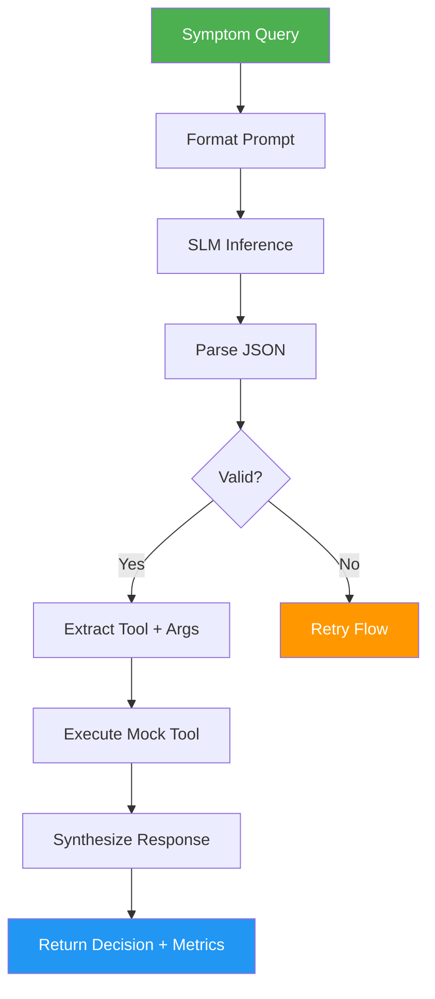
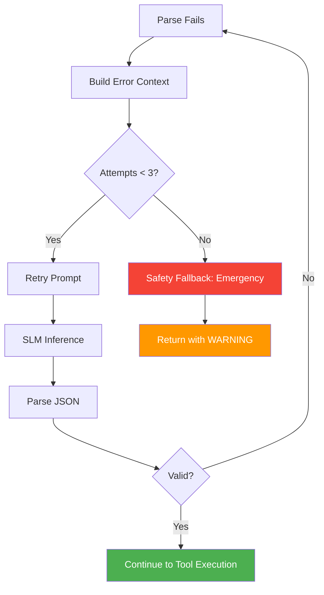
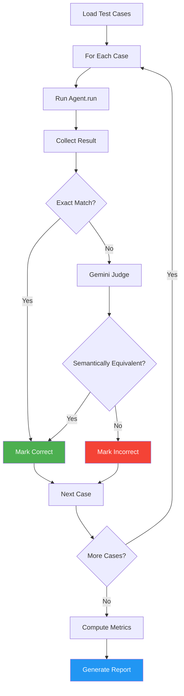

# FLOW.md — LatentSig SLM Router User Flows
> References: PRD.md (personas), DESIGN.md (data flows)

---

## Primary Flow: Symptom → Triage Decision

### Happy Path
1. User (or eval harness) provides symptom query
2. Agent formats prompt with system instructions + user query
3. SLM generates structured JSON output
4. Parser validates JSON → success
5. Agent extracts tool name + args from JSON
6. Mock tool executes → returns observation
7. Agent synthesizes human-readable triage decision
8. Response returned with latency metrics

---

## Error Flow: Hallucination Recovery

### Retry with Escalation
1. SLM outputs malformed JSON (truncated, invalid syntax, extra text)
2. Parser fails → returns error message describing what's wrong
3. Agent constructs retry prompt: original query + error message + "Output valid JSON"
4. SLM attempts again
5. If valid → continue to tool execution
6. If invalid again → retry up to 3 times total
7. After 3 failures → safety fallback (emergency category)

---

## Edge Cases & Error States

| Scenario | User/System Sees | System Does |
|----------|-----------------|-------------|
| Empty query | Validation error | Return error: "Query cannot be empty" |
| Non-medical query ("what's the weather?") | Model may output non-triage JSON | Parser rejects, retries, eventually falls back to emergency |
| Gibberish input ("asdfghjkl") | Model confused | Parser rejects, retries, falls back to emergency |
| Extremely long query (>4096 tokens) | Tokenizer truncates | Process truncated input, warn in response |
| SLM outputs valid JSON but wrong fields | Parser reports missing fields | Retry with specific error: "Missing field: category" |
| SLM outputs valid JSON but invalid enum | Parser reports invalid value | Retry with error: "Invalid category: 'critical'. Must be emergency/urgent/routine" |
| Tool name not in registry | Unknown tool | Log warning, skip tool execution, return decision without observation |
| Model OOM during inference | CUDA out of memory | Catch exception, reduce max_tokens, retry once |
| All 3 retries fail | No valid output | Safety fallback: emergency category + warning flag |
| SLM outputs correct category but wrong department | Fuzzy match may catch it | Gemini judge in eval flags it; agent still returns model's output |

---

## Eval Flow: Full Evaluation Pipeline

---

## Screen Inventory

| Screen | Route | Auth | Description |
|--------|-------|------|-------------|
| CLI Entry | `python -m src.agent "query"` | No | Single query execution |
| Smoke Test | `python run_smoke_test.py` | No | 10 sample queries |
| Quick Eval | `python -m eval.harness --quick` | No | 10 cases, fast check |
| Full Eval | `python -m eval.harness --full` | No | 100+ cases, comprehensive |
| Category Eval | `python -m eval.harness --category emergency` | No | Filter by category |
| Colab Notebook | `notebooks/eval_demo.ipynb` | No | Interactive eval with plots |
