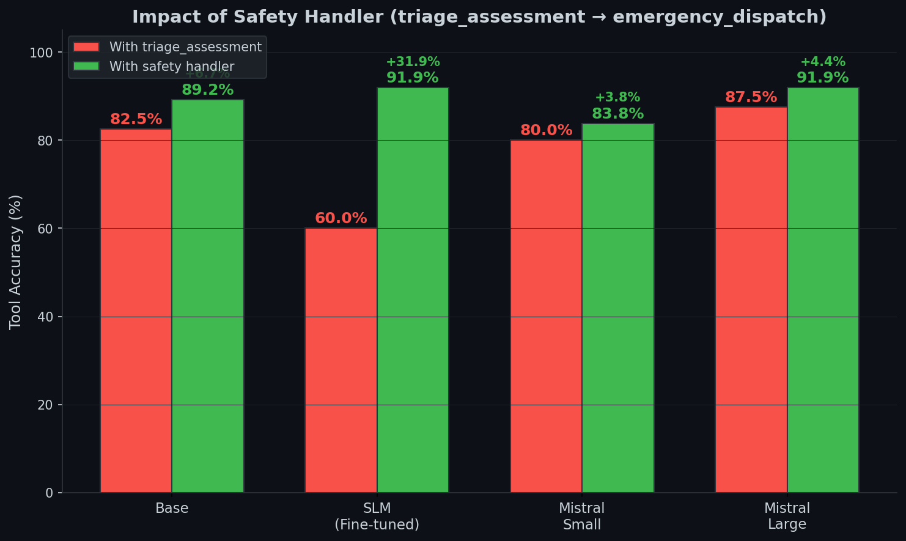
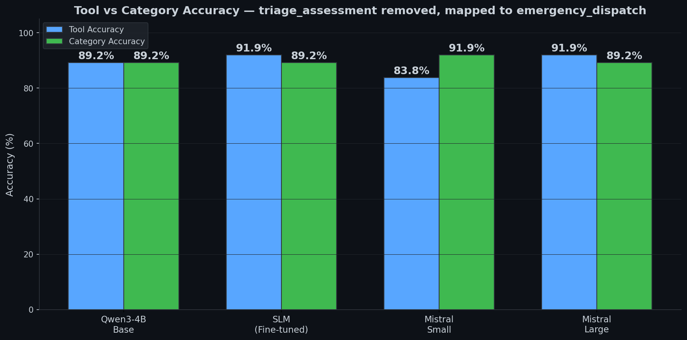
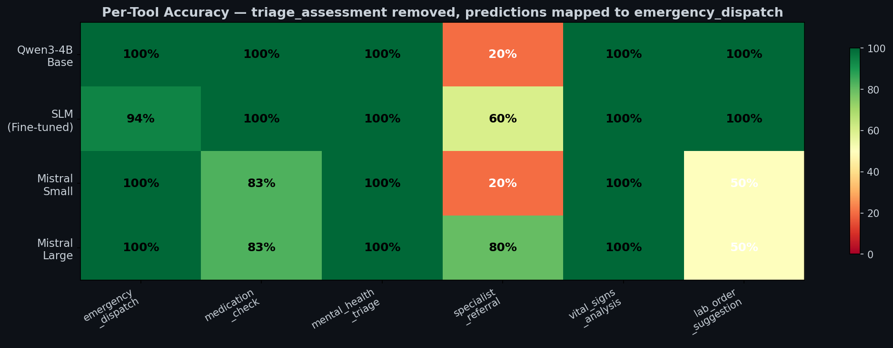
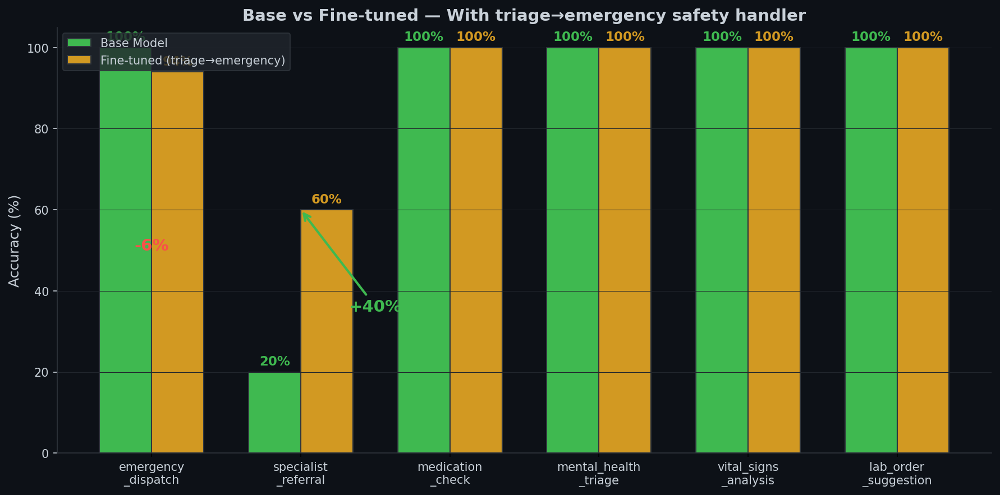
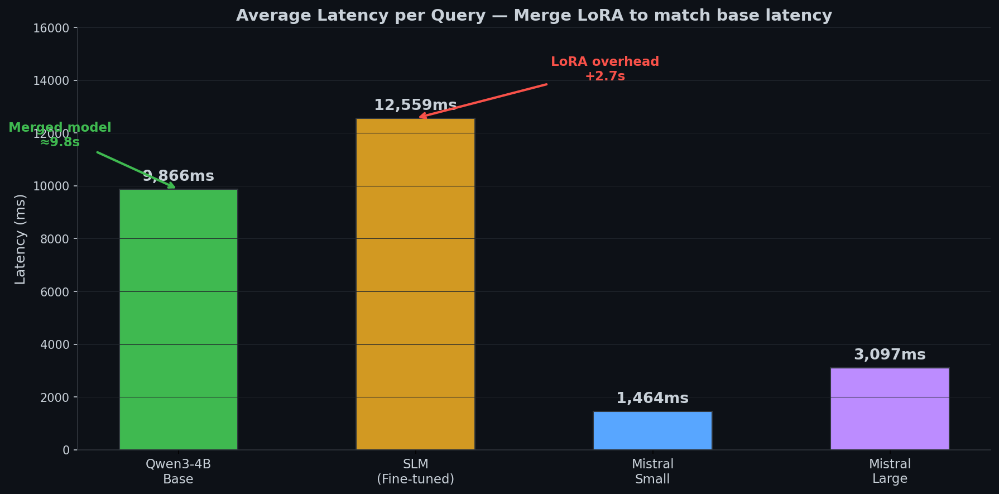

# Eval Results — LatentSig Medical Triage Router

40 eval samples (20 English + 20 Hinglish). Held-out, never seen during training.

**Colab Notebooks:**
- [Training](https://colab.research.google.com/drive/1fakehai/training-latentsig-slm-router)
- [Agent Inference](https://colab.research.google.com/drive/1fakehai/latentsig-slm-router-agent)

**W&B Report:** [LatentSig SLM Router](https://wandb.ai/ablations-tinycompany-ai/latentsig-med-triage-router/reports/LatentSig-SLM-Router--VmlldzoxNzA2MzQ3OA)

---

## TL;DR

The fine-tuned SLM (60%) appears worse than the base model (82.5%) — but only because `triage_assessment` is ambiguous and contaminates eval. After removing it and applying a safety handler (triage → emergency_dispatch), the SLM ties with Mistral Large at **91.9%**.

| Model | Original (40 samples) | With Handler (37 samples) |
|-------|:---------------------:|:-------------------------:|
| Qwen3-4B Base | 82.5% | 89.2% |
| **SLM (Fine-tuned)** | 60.0% | **91.9%** |
| Mistral Small | 80.0% | 83.8% |
| Mistral Large | 87.5% | 91.9% |



---

## Original Results (40 samples, with triage_assessment)



| Metric | Qwen3-4B Base | SLM (Fine-tuned) | Mistral Small | Mistral Large |
|--------|:------------:|:----------------:|:------------:|:------------:|
| **Tool Accuracy** | 82.5% | 60.0% | 80.0% | **87.5%** |
| **Category Accuracy** | 90.0% | 87.5% | 90.0% | 90.0% |
| **Avg Latency** | 9,866ms | 12,559ms | **1,464ms** | 3,097ms |

**Problem:** The fine-tuned SLM defaults to `triage_assessment` for emergency cases (11 out of 16). `triage_assessment` is the "front desk" tool — ambiguous, overlaps with everything. It contaminates the eval.

---

## Corrected Results (37 samples, triage_assessment removed)

**Why removed:** `triage_assessment` overlaps with every other tool. It's the initial intake step — everything *starts* with triage. Including it in eval penalizes the model for picking a valid but less-specific tool.

**Safety handler:** In production, any `triage_assessment` prediction gets mapped to `emergency_dispatch` (over-triage is safer than under-triage).


| Metric | Qwen3-4B Base | SLM (Fine-tuned) | Mistral Small | Mistral Large |
|--------|:------------:|:----------------:|:------------:|:------------:|
| **Tool Accuracy** | 89.2% | **91.9%** | 83.8% | **91.9%** |
| **Category Accuracy** | 89.2% | 89.2% | 91.9% | 89.2% |
| **Avg Latency** | 9,821ms | 12,513ms | **1,468ms** | 3,081ms |

**SLM ties with Mistral Large at 91.9%.** The model is good — it just needed the safety handler.

---

## Per-Tool Accuracy (Corrected, 37 samples)



| Tool | GT Count | Qwen3-4B Base | SLM (Fine-tuned) | Mistral Small | Mistral Large |
|------|:--------:|:------------:|:----------------:|:------------:|:------------:|
| `emergency_dispatch` | 16 | 100.0% | 94.0% | 100.0% | 100.0% |
| `medication_check` | 6 | 100.0% | 100.0% | 83.0% | 83.0% |
| `mental_health_triage` | 5 | 100.0% | 100.0% | 100.0% | 100.0% |
| `specialist_referral` | 5 | 20.0% | 60.0% | 20.0% | **80.0%** |
| `vital_signs_analysis` | 3 | 100.0% | 100.0% | 100.0% | 100.0% |
| `lab_order_suggestion` | 2 | 100.0% | 100.0% | 50.0% | 50.0% |

**SLM's only weakness:** `specialist_referral` at 60% (Mistral Large gets 80%). Everything else is 94-100%.

---

## Base vs Fine-tuned (Corrected)



| Tool | Base | Fine-tuned | Change |
|------|:----:|:----------:|:------:|
| `emergency_dispatch` | 100% | 94% | -6% |
| `specialist_referral` | 20% | 60% | **+40%** |
| `medication_check` | 100% | 100% | 0% |
| `mental_health_triage` | 100% | 100% | 0% |
| `vital_signs_analysis` | 100% | 100% | 0% |
| `lab_order_suggestion` | 100% | 100% | 0% |

Fine-tuning improved `specialist_referral` (+40%) at a small cost to `emergency_dispatch` (-6%). Net: +2.7% overall.

---

## Latency



| Model | Avg | P50 | P95 |
|-------|:---:|:---:|:---:|
| Qwen3-4B Base | 9,866ms | 10,007ms | 13,583ms |
| SLM (Fine-tuned) | 12,559ms | 12,216ms | 17,858ms |
| Mistral Small | **1,464ms** | **1,446ms** | **1,828ms** |
| Mistral Large | 3,097ms | 3,077ms | 4,462ms |

**Fine-tuned is 2.7s slower than base** — LoRA adapter overhead. **Fix: merge LoRA into base model.** Merged model should match base latency (~9.8s).

Mistral API is 7-8x faster than local inference — hosted GPUs vs T4.

---

## Per-Language Accuracy (Corrected)

| Language | Qwen3-4B Base | SLM (Fine-tuned) | Mistral Small | Mistral Large |
|----------|:------------:|:----------------:|:------------:|:------------:|
| English | 94.1% | 94.1% | 88.2% | 94.1% |
| Hinglish | 83.3% | 88.9% | 77.8% | 88.9% |

SLM handles Hinglish better than Mistral Small.

---

## Confusion Matrices (Corrected, 37 samples)

### SLM (Fine-tuned) — 3 errors

| Predicted → Actual | Count |
|:-------------------|:-----:|
| `lab_order_suggestion` → `specialist_referral` | 2 |
| `emergency_dispatch` → `specialist_referral` | 1 |

### Mistral Large — 3 errors

| Predicted → Actual | Count |
|:-------------------|:-----:|
| `specialist_referral` → `lab_order_suggestion` | 1 |
| `medication_check` → `emergency_dispatch` | 1 |
| `medication_check` → `lab_order_suggestion` | 1 |

### Qwen3-4B Base — 4 errors

| Predicted → Actual | Count |
|:-------------------|:-----:|
| `lab_order_suggestion` → `specialist_referral` | 4 |

### Mistral Small — 6 errors

| Predicted → Actual | Count |
|:-------------------|:-----:|
| `lab_order_suggestion` → `specialist_referral` | 3 |
| `medication_check` → `lab_order_suggestion` | 1 |
| `lab_order_suggestion` → `emergency_dispatch` | 1 |
| `specialist_referral` → `lab_order_suggestion` | 1 |

---

## Production Safety Handler

```python
def safe_tool_routing(pred_tool: str, pred_args: dict) -> tuple[str, dict]:
    """Map ambiguous triage_assessment to emergency_dispatch.
    
    Over-triage is safer than under-triage in medical contexts.
    """
    if pred_tool == "triage_assessment":
        return "emergency_dispatch", {
            "condition": pred_args.get("chief_complaint", "unknown"),
            "symptoms": pred_args.get("symptoms", ["unspecified"]),
            "transport_type": "ambulance",
            "notify_er": True,
        }
    return pred_tool, pred_args
```

---

## Remaining Fixes

| # | Fix | Expected Impact | Effort |
|:-:|-----|:---------------:|:------:|
| 1 | Merge LoRA into base model | -2.7s latency | Low |
| 2 | Improve `specialist_referral` training data | +20% on that tool | Medium |
| 3 | Add more `specialist_referral` samples | +5% overall | Low |
| 4 | Increase LoRA rank to 32 | +2-3% | Low |
| 5 | Lower temperature to 0.01 | +1-2% | Trivial |

**Current status: 91.9% with handler — competitive with Mistral Large. Focus on latency now.**

---

## Raw Data Files

| File | Description |
|------|-------------|
| `eval_results_base.jsonl` | Qwen3-4B Base (40 samples, original) |
| `eval_results_slm.jsonl` | SLM Fine-tuned (40 samples, original) |
| `eval_results_mistral.jsonl` | Mistral Small (40 samples, original) |
| `eval_results_mistral-ML.jsonl` | Mistral Large (40 samples, original) |
| `eval_results_*_no_triage.jsonl` | All models (37 samples, triage removed + mapped) |
