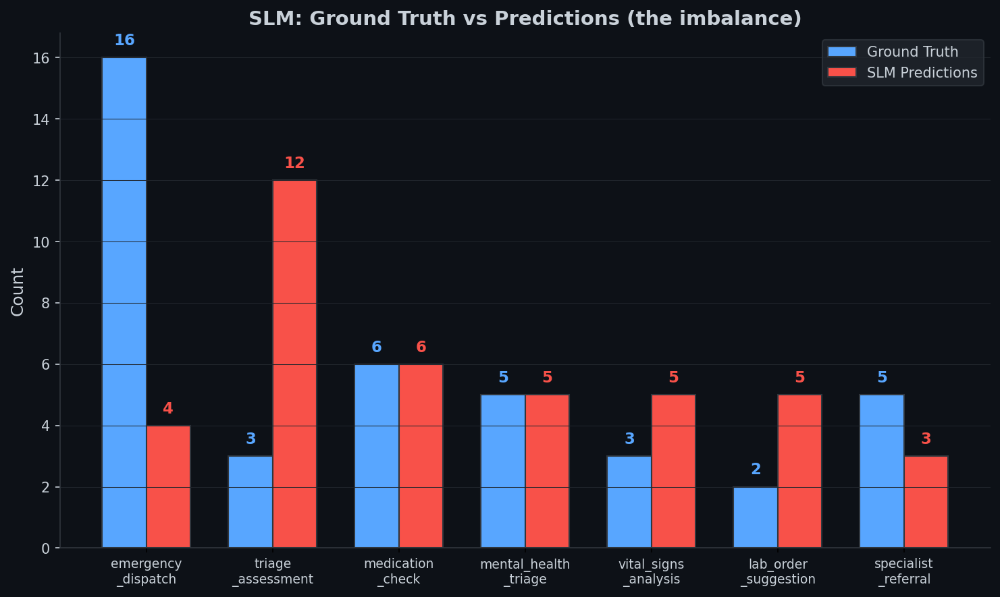

# Eval Results — LatentSig Medical Triage Router

40 eval samples (20 English + 20 Hinglish). Held-out, never seen during training.

**Colab Notebooks:**
- [Training](https://colab.research.google.com/drive/1fakehai/training-latentsig-slm-router)
- [Agent Inference](https://colab.research.google.com/drive/1fakehai/latentsig-slm-router-agent)

**W&B Report:** [LatentSig SLM Router](https://wandb.ai/ablations-tinycompany-ai/latentsig-med-triage-router/reports/LatentSig-SLM-Router--VmlldzoxNzA2MzQ3OA)

---

## Summary

| Metric | Mistral Small | Mistral Large | SLM (Ours) |
|--------|:------------:|:------------:|:----------:|
| **Tool Accuracy** | 80.0% | **87.5%** | 60.0% |
| **Category Accuracy** | 90.0% | 90.0% | 87.5% |
| **Parse Success** | 100% | 100% | 100% |
| **Fallback Rate** | 0% | 0% | 0% |
| **Avg Latency** | **1,464ms** | 3,097ms | 12,559ms |
| **P50 Latency** | **1,446ms** | 3,077ms | 12,216ms |
| **P95 Latency** | **1,828ms** | 4,462ms | 17,858ms |
| **Total Retries** | 0 | 0 | 0 |

---

## Latency

All engines are ~12.5s on T4 for the 4B model. Unsloth and GGUF show no significant speed difference — latency is dominated by model inference, not the engine.

---

## Per-Tool Accuracy

| Tool | GT Count | Mistral Small | Mistral Large | SLM (Ours) |
|------|:--------:|:------------:|:------------:|:----------:|
| `emergency_dispatch` | 16 | 100.0% | 100.0% | **25.0%** |
| `medication_check` | 6 | 83.3% | 83.3% | 100.0% |
| `mental_health_triage` | 5 | 100.0% | 100.0% | 100.0% |
| `specialist_referral` | 5 | 20.0% | **80.0%** | 60.0% |
| `vital_signs_analysis` | 3 | 100.0% | 100.0% | 100.0% |
| `triage_assessment` | 3 | 33.3% | 33.3% | 33.3% |
| `lab_order_suggestion` | 2 | 50.0% | 50.0% | 100.0% |

---

## SLM: The Imbalance Problem

The SLM predicts `triage_assessment` 12 times (should be 3). It predicts `emergency_dispatch` only 4 times (should be 16). The model defaults to the "front desk" tool instead of calling the ambulance.

---

## Per-Language Accuracy

| Language | Mistral Small | Mistral Large | SLM (Ours) |
|----------|:------------:|:------------:|:----------:|
| English | 85.0% | 90.0% | 60.0% |
| Hinglish | 75.0% | 85.0% | 60.0% |

---

## Per-Category Accuracy (SLM)

| Category | Correct | Total | Accuracy |
|----------|:-------:|:-----:|:--------:|
| emergency | 24 | 25 | 96.0% |
| urgent | 10 | 11 | 90.9% |
| semi_urgent | 1 | 2 | 50.0% |
| routine | 0 | 2 | 0.0% |

The SLM gets urgency right 87.5% of the time, but picks the wrong tool.

---

## Confusion Matrices

### SLM (Ours) — 16 errors

| Predicted → Actual | Count |
|:-------------------|:-----:|
| `triage_assessment` → `emergency_dispatch` | **11** |
| `lab_order_suggestion` → `specialist_referral` | 2 |
| `vital_signs_analysis` → `triage_assessment` | 1 |
| `vital_signs_analysis` → `emergency_dispatch` | 1 |
| `lab_order_suggestion` → `triage_assessment` | 1 |

### Mistral Small — 8 errors

| Predicted → Actual | Count |
|:-------------------|:-----:|
| `triage_assessment` → `specialist_referral` | 4 |
| `vital_signs_analysis` → `triage_assessment` | 1 |
| `triage_assessment` → `medication_check` | 1 |
| `triage_assessment` → `lab_order_suggestion` | 1 |
| `emergency_dispatch` → `triage_assessment` | 1 |

### Mistral Large — 5 errors

| Predicted → Actual | Count |
|:-------------------|:-----:|
| `vital_signs_analysis` → `triage_assessment` | 1 |
| `triage_assessment` → `specialist_referral` | 1 |
| `triage_assessment` → `medication_check` | 1 |
| `specialist_referral` → `lab_order_suggestion` | 1 |
| `emergency_dispatch` → `triage_assessment` | 1 |

---

## What's Working (SLM)

- **100% accuracy** on: `medication_check`, `mental_health_triage`, `vital_signs_analysis`, `lab_order_suggestion`
- **Category accuracy 87.5%** — knows urgency level even when picking wrong tool
- **Parse success 100%** — always outputs valid JSON
- **Zero fallbacks** — never needs safety override

---

## What's Broken (SLM)

1. **emergency_dispatch at 25%** — the most critical tool is the worst performing
2. **triage_assessment over-predicted 4x** — model defaults to "front desk" tool
3. **Latency 12.5s** — Unsloth on T4 without optimization
4. **English and Hinglish equally bad** (60% each) — tool discrimination issue, not language

---

## Fixes for SLM

### Training Data

1. **Increase emergency samples** — 2-3x oversampling of emergency_dispatch cases
2. **Hard-mine confusion pairs** — more examples distinguishing emergency from triage
3. **Add negative examples** — "chest pain from anxiety" → mental_health_triage, not emergency

### Training Config

4. **Increase epochs** — 2 → 4-5 for better tool boundary learning
5. **Increase LoRA rank** — r=16 → r=32 for more capacity
6. **Lower learning rate** — 7e-5 → 3e-5 to prevent forgetting

### System Prompt

7. **Add emergency rule** — "life-threatening symptoms → ALWAYS emergency_dispatch"
8. **Tool priority order** — emergency > mental_health > vitals > specialist > medication > lab > triage

### Post-Processing

9. **Rule-based safety net** — override triage_assessment to emergency_dispatch for critical keywords

### Inference

10. **Lower temperature** — 0.1 → 0.01 for deterministic routing

---

## Priority Fixes

| # | Fix | Expected Impact | Effort |
|:-:|-----|:---------------:|:------:|
| 1 | Increase emergency training samples | +15-20% | Low |
| 2 | Increase epochs to 4-5 | +5-10% | Low |
| 3 | System prompt emergency rule | +10% | Trivial |
| 4 | LoRA rank 16 → 32 | +5% | Low |
| 5 | Rule-based safety net | +10% | Low |
| 6 | Lower temperature to 0.01 | +2-3% | Trivial |

**Target: 80-85% tool accuracy after fixes.**

**Latency:** Both Unsloth and GGUF are ~12.5s on T4. No significant speed difference observed. Latency is dominated by the 4B model inference, not the engine.
